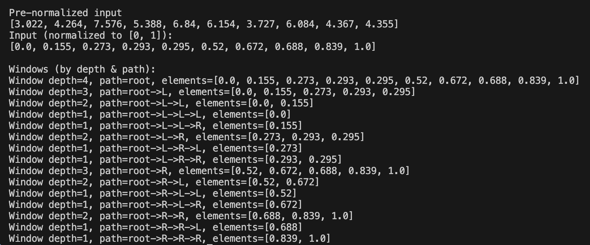

# Windower pipeline

- Takes in an array and converts to numpy array
- Optional sort()
- Applies min-max normalization
- Creates window (class) nodes recursively at depth n, splitting the sequence at each pass
- Optional print

## Key functions
- run_windower_pipeline()
- windower()

## Example Output

<p align="center">
  
</p>

## Usage

```python
import numpy as np
from windowing import run_windower_pipeline, print_windows

rng = np.random.default_rng(123)
raw = rng.normal(loc=5.0, scale=2.0, size=10)

normalized, root = run_windower_pipeline(
    raw,
    depth=4,
    sort_input=True,
    verbose=True,
    ndigits=3,
)

# If you set verbose=False above, you can print later:
# print_windows(root, "root", ndigits=3)
```

## Notes

* `depth=1` produces a single (leaf) node with no children.
* depth in the output is sort of upside down since the lowest child node is shown as 1
